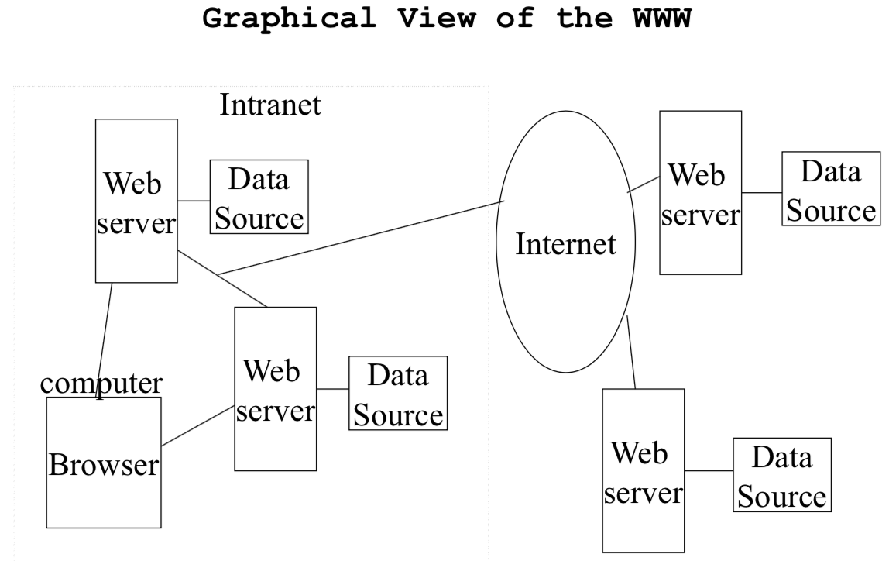
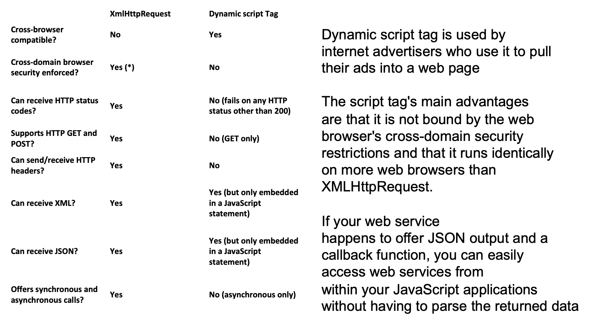
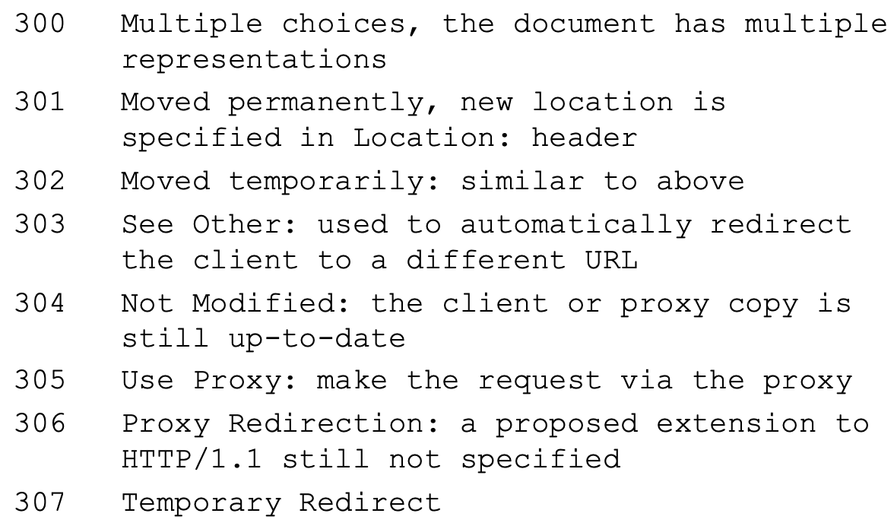
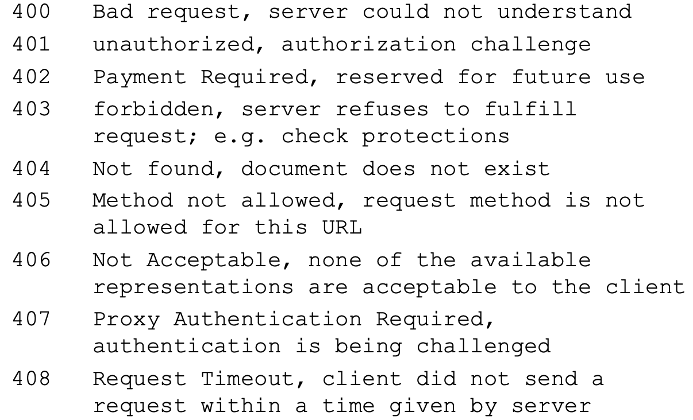
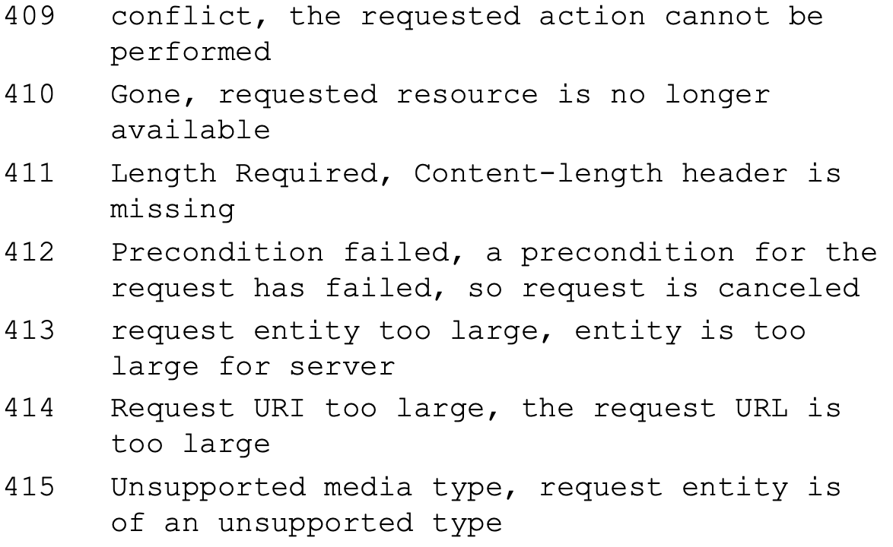
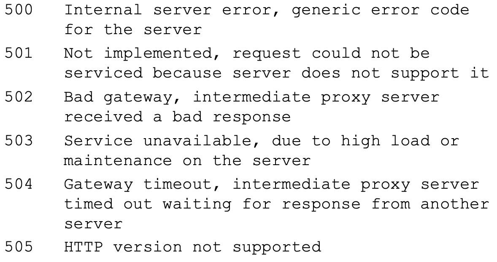
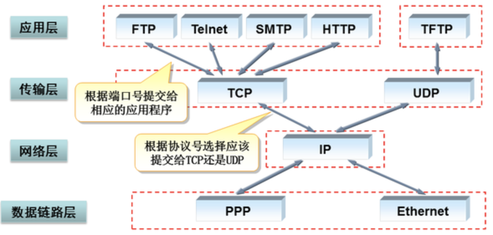
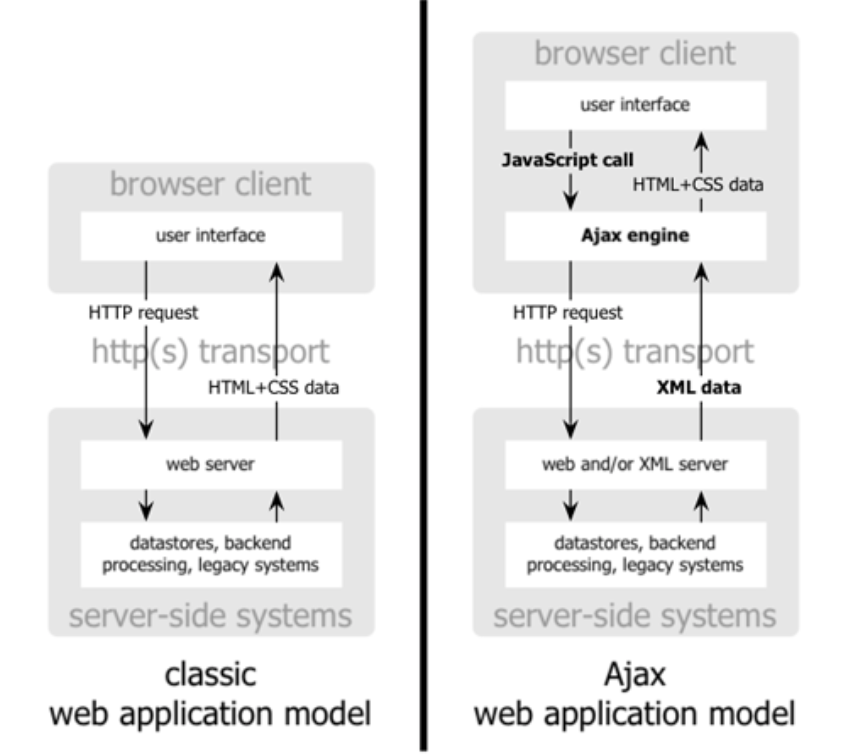

# CSCI 571 Lecture Notes

[TOC]

## Lec1 Course Introduction

### Prof. Marco Papa

- E-mail: papa@usc.edu 

- Office hours: Online Only on **Zoom**: 

  – **Wednesdays 5:00PM-6:00PM PDT (9/2-11/18)** 

  – **Meeting ID: 981 2147 6613** 

  – **Passcode: 188837** 

  – **Calendar available on D2L** 

- Online course is  __Session 3__

- Exam time (PST):

  Exam #1: October 6
  Exam #2: November 24
  Final Mobile Project: December 3


### Course objectives

__Core technologies__

- HTML and CSS
- HTTP
- Web servers
- Server-Side programming using JavaScript and Python 
- Client-side programming using JavaScript and JS Frameworks 
- Ajax Development Style 


__New technologies:__

- Responsive Website Design (Bootstrap, etc.)

- JS Frameworks (Angular, React and Node.js)

- Web Services (REST)

- Web security, TOR, Dark web

- Native Mobile frameworks (Java / Android and Swift / iOS) 
- React (native)
- Cloud computing (AWS, GCP, Azure)

- Serverless Applications, Containers, Docker

- AWS Lambda, Google Cloud Functions, Azure Functions 


### Sample Web Sites

1. Modest Size:

   www.fogdog.com: 

   - Online sale of sporting goods

   Solution:

   - Commodity hardware
   - Linux server running Apache 2.0 web servers
   - Using MySQL data base
   - Move to www.ebay.com/str/fogdog:
     - F5 BIG-IP OS, Apache 2.0.64 web server

2. Medium Size:

   www.autobytel.com:

   - New/used car sale (now AutoWeb)

   Original Microsoft solution:

   - Microsoft Windows Server

   - Microsoft IIS 7.5 web server 
   - Microsoft SQL server database 
   - Akamai CDN

   Today:

   - Windows Server
   - Microsoft IIS/7.5 web server 

3. Large Size:

   www.etrade.com

   - online investing services and resources

   Solution:

   - IBM 90 xSeries running Linux/**Citrix Netscaler**, **Apache** and Tomcat web servers, AWS Route 53 (DNS)
   - Hardware facility for load balancing and redundancy 
   - Oracle database system 
   - Proprietary programming systems 


### Web server farms

- Recently all serious web sites were maintained using web __server farms__:
  - A group of computers acting as servers and housed in a single location; 
  - Internet Service Providers (ISP’s) provide web hosting services using a web server farm 
- Hardware and software is used to load balance requests across the machines 
- Other issues  addressed:
  - Redundancy
    - Eliminate single point of failure
    - Backup and failover strategy
  - Security: secure areas behind firewalls which monitor web traffic, network address translation, port translation, SSL


__Popular Web Hosting Services:__

- For individuals and small business:
  - 1 & 1
  - GoDaddy.com
  - Yahoo
- For companies willing to pay MUCH higher cosets:
  - Rackspace
  - Network Solutions
- Reviews and price comparisons:


### Cloud Computing

- **Cloud computing** is Internet-based computing, shared resources, software, and information are provided to computers and other devices **on demand**, like the electricity grid

- User does not need to be expert in the infrastructure

- Cloud computing providers applications online that are accessed from another Web service/software

  - software and data are stored on servers

- Major cloud service provider:

  - Amazon
  - Google
  - Microsoft
  - Salesforce
  - Skytap
  - HP
  - IBM
  - Apple iCloud

  

#### Example: Amazon's Elastic Compute Cloud

- A web service providing resizable compute capacity 

- __elastic:__ the service instantly scales to meet demand with no up-front investment
- user need to create Amazon Machine Image (AMI)
- Amazon’s Simple Storage Service (S3): large- scale, persistent storage 


#### Example: Google Cloud Platform

- Basic compute, storage, big data services, massively scalable gaming solutions, mobile application backend, and Apache Hadoop
- App Engine: A platform for building scalable web applications and mobile backend, scales automatically in amount of traffic it receives
- Compute Engine: Offers predefined virtual machine configurations 
- Google uses <u>software-defined networking</u> technology to route packets across the globe and enable fast <u>edge-caching</u> so that data is where it needs to be to serve users


### Serverless Architecture

- Internet based systems, application development noes not use the usual server process
- rely on combination of:
  - 3-party services, or Backend as a Service (BaaS)
  - Client-side logic
  - Service hosted remote procedure calls, or Function as a Service (FaaS)
- __AWS Lambda__ is implementations of FaaS 


### Web Browsers Use Standard Layout Engines

- __WebKit:__ used to render web pages, open source
  - used by Chrome and Safari web browsers
- __Gecko:__ layout engine of Firefox web browser
  - used to display web pages and application's user interface
  - provide rich programming API
  - Originated with Netscape Communications Corporation
- Some web kits and the browsers that use them 
  - **Gecko-based**: FireFox (Mozilla), Flock, Netscape 
  - **Trident-shells**: Internet Explorer (Microsoft) 
  - **EdgeHTML**: Edge (Microsoft), fork of Trident 7 <u>Jan 2020 moves to Chromium</u>
  - **WebKit-based**: Chrome and Android (Google), Midori, Safari and Mobile Safari (Apple), Symbian$^3$ (Nokia) and many others 
  - __Chromium:__ Chrome
  - **Presto-based**: Opera, Nintendo DS, Opera Mini, Opera Mobile 
  - **Java-based**: HotJava, Lobo 


__Web Browsers__ can:

1. Mouse-driven graphical user interface
2. Display of
   - Hypertext documents (HTML standard)
   - Text with fonts/styles/point_size
   - Foreign-language character sets (ISO-8859)
   - Forms composed of edit boxes, check boxes, radio boxes, lists, text areas 
   - Graphics in different formats 
3. Invoke helper applications and plug-ins <u>(Obsoleted in HTML5)</u>:
   - _Adobe Acrobat_ (pdf files)
   - _Windows Media Player_ (digital sound files)
   - _Adobe Flash Player_ (video) <u>Retired in 2020</u>
4. Communicate over a secure channel (SSL)
5. Maintain/Exchange digital certificates 
6. Run scripts in JavaScript
7. run Java applets and Active X components (**also** **obsoleted in HTML5**)  


__Browser rank:__ Chrome > Firefox > Edge/IE > Safari > Opera

85% of browsers use __WebKit__ !!!!!


__Internet Explorer Browser Caching:__

- <u>History:</u> Links/URLs accessed before
- <u>Disk cache:</u> Temporary internet files
- <u>Memory cache:</u> Session-based information that is cached during the session
- <u>Offline content:</u> Web content is downloaded when online and viewed offline


### Evolution of Web Sites

- 1st gen (1991):
  - Client-centric, Static
  - HTML, Scripts, CGI
- 2nd gen (1997):
  - Server Applications, Databases, Dynamic web pages
  - ODBC, JDBC ASP, Applets, ActiveX
- 3rd gen (2000):
  - Web services Multiple layers, Business and service Integration
  - XML, WML, SQL, .NET, COM+, Beans
- 4th gen (2005):
  - Service Oriented Arch (SOA), Client-centric
  - Ajax, Web 2.0, JSON 
- 5th gen (2008):
  - Multi-platform (desktop, tablet, phone), Client-centric 
  - HTML5, CSS3, JS, gestures navigation
- 6th gen (2014):
  - IoT, Wearables, Cloud computing, Serverless Arch (Baas, Faas)
  - JS Frameworks, AWS, GCP, Azure, Microservices containers


## Lec2 Internet Trends and Web Basics

### Internet Trends

- Internet:__ a global digital infrastructurethat connects computers

- __WWW:__ a mechanism that unifies the retrieval and display of a subset of data on the Internet

- __Intranet:__ a local/global information structure that connects an organization internally. (also use Web technologies now)
- __Extranet:__ a private network that uses the public telecommunication system to securely share part of a business's information/operations


__Recent trends in Internet Development:__

- Growth:
  - number of users connected 
  - Smartphone use (iOS/Android)
  - digital data (photo/video)
  - Social media
  - Internet use from Mobile/tablet (平板和移动端) over desktop/laptop
  - use of cloud
- Derease: dominance of Microsoft Windows


Host counts in 2019 > 1,012 million


### IoT

__IoT:__ the Internet of Things

#### IoT Protocols

- Device/thing to Gateway:
  - ZigBee: Wireless sensors
  - BLE: Wireless sensors
  - ModBus (Serial or TCP)
- Gateway to Server:
  - ModBus TCP: common
  - OPC: common for industrial assets
  - HTTP: JSON over HTTP
  - MQTT: Consumer oriented, promising


#### IoT platforms

- Amazon IoT
  - Physical/Shadow Device (Persisted JSON State)
  - MQTT Endpoint
  - Rules
  - AWS Connectivity
- GE Predix 2.0 (PaaS)
  - CloudFoundry, HDP
  - Asset Model, Machine Connectivity, Time Series DB, Analystics Plugin (BPMN)
- PTC ThingWorx
  - Originally HMI for TCP-connected devices
- Xively
  - Device connectivity, time series database, connectivity to applications
  - Popular with Arduino developers


### Domain Name System (DNS)

__DNS resolution:__

- when visit a website, the computer need to perform DNS lookup
- Complex pages require multiple DNS lookups before loading 
- DNS latency mainly from:
  - round-trip time to make the request and get the response, due to network congestion, overloaded servers, denial-of-service attacks 
  - Cache misses which cause recursive querying of other name servers 
- Google has introduced **Google Public DNS** 
  - use 8.8.8.8 and 8.8.4.4 
  - handles more than 70 billion requests ***a day!*** 
  - Google also has IPv6 addresses 
- Another alternative is **opendns.com**
  - a global network of DNS resolvers to speed resolution
  - Free for basic service, but upgrades cost


### Internet Domain Names

- DNS is a mapping to/from IP addresses to domain names
  - Defined in RFC 1034, 1035
- 13 top level root name services
- founded in 1998, ICANN is the organization in charge of maintaining the DNS system


#### Top Level Domain Names (TLDs)

- __In 1984__, __originally__ divided into __6__ logical categories
  - com
  - edu
  - gov
  - mil
  - net
  - org
- __In 2001__ new top level domain added:
  - biz, info, name, musem, coop, aero, pro, xxx 
- __In 2009__ ICANN agreed to accept internationalized domain names, encoded as Unicode
- __In 2011__ ICANN announced expansion of TLDs, giving requirements for anyone wanting to establish one

<u>In 2019 ``.com``, ``.net`` are the most popular top name domain.</u>


### World Wide Web

Define:

- A wide-area hypertext, multimedia information retrieval system that provides access to a large universe of documents 
- A uniform way of accessing and viewing some information on the Internet 
- WWW subsumes the capabilities of ftp, gopher, wars, and news



#### Major Technology Components

- Client/server architecture: client programs interact with web
  servers
- Network protocol: HTTP understood by browsers and web servers
- Addressing system (Uniform Resource Locators)
- Markup Language: support HyperText and multimedia


#### WWW server

- Web browsers/servers communicate according to a protocol (HTTP)
  - current HTTP is version 1.1
- The Web server is a software system running on a machine often called the Web server 
- A web server __can__

  - receive/reply to HTTP requests

  - retrieve documents from specified directories 
  - run programs in specified directories

  - handle limited forms of security 
- A web server __does not__
  - know about the contents of a document, links in a document, images in a document or whether a particular file, e.g. a *.gif file, is in the correct format


#### Uniform Resource Locator (URL)

- A mechanism whereby an Internet resource can be specified in a single line of ASCII text
- RFC 1738


__General description of URL:__

1. Scheme
   - http:, ftp:, news:, wais:
2. Double dash //
3. Internet domain name: usc.edu
4. Port number (optimal)
5. Path


#### Markup Languages

- HTML: hypertext markup language, specifies document layout and the specification of hypertext links to text, graphics and other objects 
- Browsers display text and graphics using the markup as guidance 

> HyperText: Regular text, with the additional feature of links to related documents


## Lec3 HTML

#### What is HTML?

- hypertext markup language (HTML) can describe:
  - The display and format of text
  - The display of graphics
  - Pointers to other html files
  - Pointers to files containing graphics, digitized video and sound
  - Forms that capture information from the viewer
- HTML: by __Tim Berners-Lee__ of CERN around 1990
- understand by WWW browsers


#### Version of HTML

- 1990 V0: original one
- V1: highlighting & images
- 1995 V2: V0 + V1 + forms
- 1997 V3.2: released by W3CW, tables
- 1999 HTML4.01
- 2014 HTML5: vocabulary & APIs
- 2017 HTML5.2
- 2019: __HTML Living Standard__ 
- W3C & WHATWG agreement


#### HTML General Structure

- HTML documents have a __head__ and __body__

- A leading line indicates the version of HTML

  ```html
  <!DOCTYPE HTML PUBLIC "-//W3C//DTD HTML 4.0//EN" "http://www.w3.org/TR/REC-html40/strict.dtd">
  ```

- __comments in HTML:__ ``<!--this is comment-->``, cannot be nested

> IE/Firefox are tolerant browsers:
>
> - not insist that the HTML document begin and end with ``<HTML>``
> -  ``<HEAD>`` and/or ``<BODY>`` tags are not required

- HTML chracter set

  - HTML uses __Universal Character Set (UCS)__, defined in ISO10646
  - Character references:
    - __numeric__
    - character __entity__

- HTML anchor

  - to designate a **link to another document** or to a specific place in the **same document**
  - anchor ``name``: __Unique__ & __String matching__
  - anchor using ``id`` attribute: use ``href=#id`` where ``id`` is from other tag
  - ``id`` and ``name`` attributes share the same name space (cannot use same as each other)

- Universal Resource Identifier (__URI__): 

  - **scheme** of the mechanism used to access the resource
  - name of the machine **hosting** the resource
  - name of the **resource** itself, given as a **path**

  > - *Fragment identifiers* are URIs that refer to a location within a resource
  >
  >   e.g. http://www.usc.edu/dept/cs/index.html**#section2**

- ``link`` element in ``<head>`` part: provide a variety of information to search engines

  - Links to **alternate versions** of a document, written in another human language
  - Links to alternate versions of a document, designed for **different media**
  - Links to the starting page of a collection of documents
  - Links to style sheets and “**media queries**” used in Responsive Web Design

- Create graphic:

  - image source:
    - digital camera/phone
    - graphic editor
    - scanner
  - image format:
    - __x-pixelmaps__: 256 colors
    - __GIP__
    - __JPEG__: includes image compression; for photographic images
    - __PNG__ (portable network graphics): lossless compression; patent-free compared with GIF & TIFF
  - why ``alt`` attribute in ```` tag? replace an image with text, if the image is unavailable or a text browser is used
  - active image: with a border around it and the cursor changes shape when passed over
  - ``usemap`` attribute in ```` tag

- ``<meta>`` element: insert Name/Value pairs describing document properties

  - ``<meta>`` & robotic exclusion: ``<meta name="robots" content="[no]index,[no]follow">``
    - index: whether the search engine can index the page
    - follow: whether the web crawler can follow links contained by the page

- Why validate HTML?

  - Browsers display HTML differently
  - Browsers treat HTML errors differently


## Lec4 HTML: Style Sheets

- start from HTML4.x

- style sheets specify:

  - the amount of white space between text or between lines
  - the amount lines are indented
  - the colors for text/backgrounds
  - font size and text style
  - the precise position of text/graphics

- Style sheet language: ``CSS``, ``XSL``

- express style within HTML:

  - ``<style>`` element and ``style`` attribute

  - ``<link>`` to point to external style sheets

    - combining style information from multiple sources, called cascading

      > There is a defined order of precedence where the definitions of a style element conflict

> **Pre-defined color** names
>
> Black="#000000"                   Silver="#C0C0C0" 
>
> Gray="#808080"                    White="#FFFFFF" 
>
> Maroon="#800000"              Red="#FF0000" 
>
> Purple="#800080"                Fuschia="#FF00FF"
>
> Green="#008000"                 Lime="#00FF00" 
>
> Olive="#808000"                   Yellow="#FFFF00" 
>
> Navy="#000080"                   Blue="#0000FF" 
>
> Teal="#008080"                    Aqua="#00FFFF"


#### Use inline stle attribute

```html
<HTML>
   <HEAD>
   <TITLE>Setting Body Attributes</TITLE> 
   </HEAD>
   <BODY style="font-size: 20pt;background: green; color: fuchsia"> 
   The nine planets of the solar system ...
   </BODY>
</HTML>
```


#### Use ``<style>`` element

```html
<HTML>
<HEAD>
  <TITLE>The Solar System</TITLE> 
  <STYLE type="text/css">
    BODY {text-align: center} 
  </STYLE>
</HEAD>
  
<BODY>
  <P>The nine planets of the solar system are <B>mercury, venus, earth, mars, jupiter, saturn, uranus, neptune and pluto.</B></P>
  <P>The very nearest star is about <I>7,000</I> times farther away than pluto is to our sun.</P>
</BODY> 
</HTML>
```

- ``ID`` attribute can only be used once in the entire document
- ``class`` rule preceded by  ``.`` and applied to multiple elements
- Values assigned to ``ID`` and ``class`` are case sensitive


#### Composite Styles

```html
font-family: Verdana, Arial, Helvetica, sans-serif; font-size:small;
font-style:normal;
font-variant:small-caps;
font-weight:bold; 
line-height:2em;
```

is equal to

```html
font: normal small-caps bold small/2em Verdana, Arial, Helvetica, sans-serif;
```


#### ``DOCTYPE`` directive

- Instructs modern browsers to work in ‘standards compliant mode
  - Your web page will look the same in **all** browsers – Browsers turn off their proprietary extensions
  - Fonts are rendered in the same way
    - For example, **font-size: small**, is rendered the same size on all browsers

- **HOWEVER**, if you do not specify a ``!DOCTYPE``, browsers work in ``Quirks`` mode
  - Internet Explorer will display fonts larger than standards mode
  - IE Uses the ‘broken box model’
    - Measures the dimensions of a box using the inner size, not the outer size as in standard mode


#### Style Sheet Media Types

- Enable authors to create documents for different media types:

```html
<HEAD>
<STYLE type=text/css media=projection>
H1 {color:blue}
</STYLE>
<STYLE type=text/css media=print>
H1 {text-align:center} 
</STYLE>
</HEAD>
```

- Used in CSS3 for __media queries__

```html
<style>
@media all and (min-width:500px) { ... } 
@media (min-width:500px) { ... } 
</style>
```

```html
<link rel="stylesheet" type="text/css" media="screen and (max-device- width: 480px)" href="min.css" />
```

- recognized media types:

  ``all``, ``braille``, ``embossed``, ``handheld``, ``print``, ``projection``, ``screen``, ``speech``, ``tty``, ``tv``, ``3d-glasses``


#### Pseudo Elements and Classes

- pseudo-classes

  - **:link** – a normal, un-visited link
  - **:visited** – a link the user has visited
  - **:hover** - a link when the user mouses over it
  - **:active** - a link the moment it is clicked
  - __:lang__ - selects every ``<p>`` element with a lang attribute
  - __:focus__ - selects the input element which has the focus
  - __:first-child__ - select every ``<p>`` elements that is the first child of its parent

- pseudo elements

  - **:first-line**, add a special style to the first line of a text

  - **:first-letter**, add a special style to the first letter of a text
  - **:before**, to insert some content before the content of an element
  - **:after**, to insert some content after the content of an element


### Properties of Style Setting

#### 1. Inheriting Style Properties

__Some CSS property values set on parent elements are _inherited by their child elements_, and some aren’t.__

- ``<DIV>`` and ``<SPAN>`` tags have no initial presentation properties
  - **exception**, line break before and after a ``<DIV>`` tag – ``<SPAN>`` applies to **inline** elements (example: ``<b>``)
  - ``<DIV>`` applies to **block** elements (example: ``<p>``)
- With CSS, properties such as text-align are “inherited” from the parent element

#### 2. Precedence (specificity)

__Specificity is how the browser decides which rule applies _if multiple rules have different selectors_ but could still apply to the same element.__

- The more precise a specification is, the higher the precedence
- a style for tag.class has higher precedence than one for .class, which has higher precedence than a style for the tag itself
- styles defined using a ``style`` attribute (inline) have highest precedence
- styles defined using ``<STYLE>`` element have next highest precedence
- styles defined in a separate file, e.g. special.css, have lowest precedence

#### 3. Cascade

__At a very simple level this means that the _order of CSS rules matter_; when two rules apply that have equal specificity the one that comes _last_ in the CSS is the one that will be used.__


### Box Model

Each box has a **content** *area* (e.g., text, an image, etc.) and optional surrounding **padding**, **border**, and **margin** areas.

```css
margin: 10px 5px 15px 20px;
```

means:

top margin is 10px
right margin is 5px
bottom margin is 15px
left margin is 20px


### CSS Vendor Prefixes

The CSS browser prefixes are:

- –  Android: -webkit-
- –  Chrome: -webkit-
- –  Firefox: -moz-
- –  Internet Explorer: -ms-
- –  iOS: -webkit-
- –  Opera: -o-
- –  Safari: -webkit-


### Reset CSS

- A **CSS Reset** is a short, often compressed (minified) set of CSS rules that *resets* the styling of all HTML elements to a consistent baseline.
- The goal of a reset stylesheet is to reduce browser inconsistencies in things like default line heights, margins and font sizes of headings, and so on.


## Lec5 JavaScript Basics

- JavaScript has 2 distinct systems
  - server-side JavaScript runs on Web servers
  - client-side JavaScript runs on Web browsers\
- JavaScript syntax resembles C, C++, and Java
- Developed in 10 days by **Brendan Eich**, in __May 1995__
- originally named as __Mocha__
- renamed as __LiveScript__, then __JavaScript__


JavaScript is embedded in HTML:

- in the body

  ```html
  <HTML>
  <HEAD>
  </HEAD>
  <BODY>
  <SCRIPT LANGUAGE="JavaScript">
  document.write("Last updated on " + document.lastModified + ". ")
  </SCRIPT>
  </BODY>
  </HTML>
  ```

- in the ``<head>`` as a deferred script

  ```html
  <HTML>
  <HEAD>
  <SCRIPT LANGUAGE="JavaScript">
  //the Javascript here creates functions for later use </SCRIPT>
  </HEAD>
  <BODY>
  </BODY>
  </HTML>
  ```


#### Event Handlers

- Mouse events
  - ``onclick``
  - ``onblclick``
  - ``onmouseover``
  - ``onmouseout``
- Keyboard events
  - ``onkeydown``
  - ``onkeyup``
- Object events
  - ``onload``
  - ``onunload``
  - ``onresize``
  - ``onscroll``


#### What JavaScript can do?

Designed for __manipulating web pages__, but can also be general-purpose language.

- Control Web page appearance and content (intended)
- Control the Web browser, open windows, test for browser properties
- Interact with document content
- Retrieve and manipulate all hyperlinks
- Interact with the user, sensing mouse clicks, mouse moves, keyboard actions
- Read/write client state with cookies


__Limitations of Client-side JavaScript:__

- __was__ difficult to draw graphics
  - <u>has been dramatically improved in the latest versions</u>
- No access to the underlying file system or operating system
- Unable to open and use arbitrary network connections
- No support for multithreading
- __was__ not suitable for computationally intensive applications
  - <u>has been improved in the latest versions</u>


### JavaScript

#### Basics of the Language

- __case-sensitive__ (HTML is not case-sensitive)
- __ignores__ spaces, tabs, newlines (can be __minified__)
- Semicolon is optional
- C and C++ style comments are supported


#### Literals

- __numbers__

- __boolean__

- __strings__: <u>immutable</u> (cannot be changed after created)
  - string properties: ``str.length``, ``str.tolowerCase``, ``str.toupperCase``, ``str.indexOf``, ``str.charAt``, ``str.substring``


#### Variables

- __scope__: 
  - Any variable outside a function is a **global** variable and can be referenced by any statement in the document
  - Variables declared in a function as “var” are **local** to the function
    - if var is omitted, the variable becomes global


#### Arrays

- **array properties**: 1 dimensional, indexed from zero
- ``arr.length``
- Arrays are **sparse**: most elements are not allocated after initiation
- loop
  - ``for (i=0; i<len; i++) {}``
  - ``for (x in person) {}``
  -  ``while (condition) {}``
- built-in methods:
  - ``concat()``
  - ``indexOf()``
  - ``pop()``
  - ``push()``
  - ``reverse()``

#### Object

- Objects can be nested within objects
- predefined object:
  - ``Array object``
  - ``Date object``
  - ``Function object``
  - ``Math object``
  - ``RegExp object``
  - ``String object``

#### Popup Boxes

- ``alert()``, ``confirm()``, ``prompt()``


### Common mistakes 

- **Undefined may not be null** : use ``!==`` to test, will fail if use ``!=`` 
-  **cannot overload a function**: the latest-defined version of function will be used
- **Undeclared variables are global** : if a variable is NOT declared using ``var``, then it is global


### ECMAScript

- JavaScript now controlled by the ECMA standard body
- **ECMA** stands for **European Computer Manufacturers**
- First language specification, ECMA-262, a.k.a. ECMAScript, approved in 1997, closely resembles Netscape JavaScript 1.1
- Current language specification is **ECMA-262, 10****th** **Edition, June 2019, ECMAScript © 2019**


## Lec6 JavaScript Object Notation （JSON）

#### What is JSON?

- **JSON**, short for **JavaScript Object Notation**, is a lightweight data interchange format
- JSON format is often used for transmitting structured data over a network connection in a process called __serialization__


#### Brief History

- JSON was based on a subset of the JavaScript programming language


#### How to use the JSON format?

A JSON file allows one to load data from the server or to send data to it.

Working with JSON involves three steps: 

1. the browser processing: the content of a JSON file or the definition of JSON data is assigned variavle, and this variable becomes an object of the program

2. the server processing: a JSON file on the server can be operate upon by various programming languages, and may even convert it into classes and attributes of the language

3. the data exchange between them: 

   - loading JSON file from the server may be accomplished in JavaScript in several  ways:
     - directly including the file into the HTML page, as a JavaScript .json external file
     - loading by a JavaScript command
     - using XMLHttpRequest

   - To convert JSON into an object, it can be passed to the JavaScript eval() function
   - Sending the file to the server may be accomplished by XMLHttpRequest. The file is sent as a text file and processed by the parser of the programming language that uses it


### JSON Basic Data Types

- String
- Numbers
- Booleans
- Object: __unordered__ containers of __key/value__ pairs
- Array: __ordered__ sequences of values, indexing is not mentioned in JSON (an implementation can start array indexing at 0 or 1)
- Null

> __Array vs Object__
>
> - Use objects when the key names are <u>arbitrary</u> strings
> - Use arrays when the key names are <u>sequential</u> integers

<u>__JSON is Not XML !!!__</u>

<u>JSON uses less data to represent the same information than XML!!</u>

#### Rules for JSON Parsers

- the decoder must accept all well-formed JSON text
- the decoder may also accept non-JSON text
- the encoder must only produce well-formed JSON text


### Same  Origin Policy

- ``same protocol`` + ``same host`` + ``same port``
- Same origin policy is a security feature that browsers apply to client-side scripts
- It prevents a document or script loaded from one “origin” from getting or setting properties of a document from a different “origin”


### JSON: the Cross-Domain Hack

- JSON and the ``<script>`` tag provide a way to get around the Same Origin Policy
- The src attribute of a script tag can be set to a URL from any server, and every browser will go and retrieve it, and read it into your page
- So a script tag can be set to point at a URL on another server with JSON data in it, and that JSON will become a global variable in the webpage
- So JSON can be used to grab data from other servers, without the use of a server-side proxy
- available in HTML since 1994


#### XMLHttpRequest Compared to the Dynamic Script Tag




### Arguments against JSON

- JSON doesn't have namespaces
- JSON has no validator
  - Every application is responsible for validating its inputs
- JSON is not extensible
- JSON is not XML
  - but a JavaScript compiler is a JSON decoder


<u>``Eval()`` is fast but very dangerous!</u>

To help guard the browser from insecure JSON input, use **JSON.parse()** instead of ``eval`` ; e.g.  ``JSON.parse()``  is used this way

`````json
var myObject = JSON.parse(JSONtext [, reviver]);
`````

``eval()`` will execute the string content but ``json.parse()`` will not.


### JSONP

- "JSON with padding", a JSON extension wherein the name of a callback function is specified as an input argument of the call  itself
- It is now used by many Web 2.0 applications such as Dojo Toolkit Applications or Google Toolkit Applications
- JSONP may be inappropriate to carry sensitive data (make use of script tags, and open to the world)
- supported by jQuery


## Lec7 Python

- Variables assigned values inside a class declaration are **class variables**
- Variables assigned values in class methods are **instance variables**
- **Note:** Python **DOES NOT** support ‘++’ and ‘--’ notation for auto increments and decrement
- Strings are **immutable**


### Flask

- Flask is a lightweight **WSGI** (**Web Server Gateway Interface**) web application framework
- WSGI specifies a standard interface between web servers and Python web applications or frameworks
- Flask offers suggestions but doesn't enforce any dependencies or project layout
- ``render_template()``
- ``send_static_file()``


## Lec8 Document Object Model (DOM)

- __DOM__ : programming interface for XML documents (<u>access</u> & <u>manipulate</u>), includes HTML documents
- XML DOM is designed to be used with **any programming language** and any **operating system**
- DOM represents an XML file as a tree
  - top-level: ``documentElement``


### Useful DOM Functions

- ``document`` **is the root element**
- ``document.getElementById("sample")``
- ``document.getElementsByTagName("font")``
- ``innerHTML``： 
  - first introduced as non-standard extension in IE
  - widely used in Ajax-based site
  - Elements that do not have both an opening and closing tag cannot have an ``innerHTML`` property
  - ``innerHTML`` has been added to the HTML5 specification
- ``style.left``, ``style.color`` properties
- Newer browsers use “Synchronous” XMLHttpRequest


### ``XMLHTTPRequest`` Object

- an XMLHttpRequest object can
  - Update a web page without reloading the page
  - Request data from a server after page has loaded
  - Receive data from a server after page has loaded
  - Send data to a server in the background
- "Synchronous" XMLHttpRequest is in process of being removed from web platform (will take many years)


> **Firefox and I.E. Represent DOM Structures Differently**
>
> Firefox view space as nodes in DOM tree too!


## Lec9 Forms and Common Gateway Interface Mechanism

### Forms

- ``AUTOCOMPLETE``: input history
- ``ONRESET=Script``
- ``ONSUBMIT=Script``
- ``<input>`` tag
  - type: ``submit``, ``reset``, ``text``, ``textarea`` (multiline input), ....
- ``<select>`` tag
  - ``<option>`` tag

#### Form Control Group: ``fieldset``

```html
<FIELDSET> <LEGEND ACCESSKEY=O>...</LEGEND>
...
</FIELDSET>
```


### Common Gateway Interface (CGI)

#### Purpose of CGI

- used to create dynamic Web documents
  - Scripts are placed in a server directory often named cgi-bin
  - Scripts can deliver information that is not directly readable by clients
  - Scripts dynamically convert data from a non- Web source (e.g. DBMS) into a Web-compatible document
- __common gateway__ : programs act as gateways between the ``WWW`` and other type of data/service


#### CGI Script Environment Variables

- a set of pre-defined dynamic values that can affect a running program
- part of the operating environment
- ``UNIX``/``Windows`` use these as a means of passing information about the environment of a process
- created by the web server and set before web server executes a gateway script
- Can be classified into two major categories
  - **Non-request-specific**: ``SERVER_NAME``, ``SERVER_PORT``, ``SERVER_SOFTWARE``, ``SERVER_PROTOCOL``, ``GATEWAY_INTERFACE``
  - **Request-specific**: ``PATH_INFO``, ``REQUEST_METHOD``, ``SCRIPT_NAME``, ``QUERY_STRING``


## Lec12 HTTP Protocol

### What does WWW server do?

- Enables browser requests
- Provides
  - Support for retrieving hypertext documents
  - Manages access to the Web site
  - Provides several mechanisms for executing server-side scripts
    - Common Gateway Interface (CGI)
    - Application Programmers Interface (API)
  - produces log files and usage statistics


### How does a Web server communicate?

- Web browsers and servers communicate using the **HyperText Transfer Protocol** (HTTP)
- HTTP is a **lightweight** protocol
  - FTP protocol: FTP session is long lived and there are 2 connections (1 for control, 1 for data)
- Current HTTP is version 1.1
- HTTP 2.0 under the IETF httpbis working group


### HTTP History

- application-level protocol for distributed, collaborative, hypermedia information systems
- first version of HTTP: __HTTP 0.9__, a simple protocol for raw data transfer across the Internet
- HTTP 1.0 is defined by RFC 1945, messages containing meta-information about the data reansferred and modifiers on the request/response semantics
- HTTP 1.1 is defined by RFCs 7230-7237,  being able to handle the handle
  - the effect of hierachical proxies
  - caching
  - the need for persistent connections
  - virtual hosts
- HTTP 2 worked by IETF working group
  - started as a copy as a copy of Google SPDY (<u>SPeeDY</u>)
  - speed up websites far larger than 10 years ago, using hundreds of requests/connections
  - uses __header compression__
  - Google has dropped SPDY from Chrome and adopted HTTP 2
  - Dozens of implementations (server) already available, including **Apache (2.4+)**, Apache-Tomcat (8.5+), **Nginx (1.9.5+)**


### MIME Media types

- HTTP tags all data that it sends with its MIME type

- HTTP sends the MIME type of the file using the line

  ```http
  Content-Type: [mime type header]
  ```

  for example:

  ``Content-type: image/jpeg``,  ``Content-length: 1598``

- MIME types:

  - ``text/plain``, ``text/html``
  - ``image/gif``, ``image/jpeg``
  - ``audio/basic``, ``audio/wav``, ``audio/x-pn-realaudio``
  - ``model/vrml``
  - ``video/mpeg``, ``video/quicktime``, ``video/vnd.rn- realmedia``, ``video/x-ms-wmv``
  - ``application/*``, ``application-specific`` data that does not fall under any other MIME category, e.g. application/vnd.ms-powerpoint

- MIME: __Multipurpose Internet Mail Extensions__, an Internet standard for **electronic mail**

  - Traditional e-mail was limited to ASCII text, limited line length, and limited size

- MIME has extended Internet e-mail to include

  - Unlimited text line and message length
  - Messages with multiple body parts or objects enclosed
  - International character sets in addition to US-ASCII
  - Formatted text including multiple font styles
  - Images
  - Video clips
  - Audio messages
  - Application-specific binary data

- was formalized in RFC 2046

- converts 8-bit data into 7-bit ASCII, sends it, and reconverts it at the other end


### HTTP Scenario

#### An HTTP 1.0 "default" Scenario

Communication takes place over a TCP/IP connection, generally on __port 80__.

|                        Client action                         |                       Server response                        |
| :----------------------------------------------------------: | :----------------------------------------------------------: |
|                 1. client opens a connection                 |           server response with an acknowledgement            |
|        2. Client sends HTTP request for HTML document        | server responses with the document and closes the connection |
| 3. Client parses the HTML document and opens a new connection; it sends a request for an image | server responds with the inlined image and closes the connection |
| 4. Client opens a connection and sends another request for another image |   server sends the inlined image and closes the connection   |

#### A more Complicated HTTP Scenario

- communication can go between one or more **intermediaries**
- Common forms of intermediary:
  - __proxy:__ a forwarding agent, receives requests for a URL in its absolute form, rewrites all or part of the message, and forward the reformatted request toward the server identified by the URI
  - __gateway:__ a receiving agent, acts as a layer above some other servers and, if necessary, translating the requests to the underlying server's protocol
  - __tunnel:__ acts as a relay point between two connections without changing the messages; tunnels are used when the communication needs to pass through an intermediary (firewall for example) even through an intermediary cannot understand the  contents of the messages (<u>no caching</u>)

##### Caching Proxies

A __web cache__ or __caching proxy__ is a special type of HTTP proxy server that keep copies of popular documents that pass through the proxy (“forward” proxy). The next client requesting the same document can be served from the cache's personal copy.

__<u>Forward proxy hides the clients, backward proxy hides the servers.</u>__


##### Gateways

Gateways are special servers that act as intermediaries for other servers, used to convert HTTP traffic to another protocol. A gateway always receives requests as if it was the origin server for the resource. The client may not be aware it is communicating with a gateway.

> __Example__
>
> an HTTP/FTP gateway receives requests for FTP URIs via HTTP requests but fetches the documents using the FTP protocol. The resulting document is packed into an HTTP message and sent to the client.


##### Tunnels

Tunnels are HTTP applications that, after setup, blindly relay raw data between two connections. HTTP tunnels are often used to transport non-HTTP data over one or more HTTP connections, <u>without looking at the data</u>.


#### the Most General HTTP Scenario

Communication between browser and server should be regarded as a **request chain** goes left to right, and a __response chain__ goes right to left:

__``UA``__-->__``A``__-->__``B``__-->__``C``__-->__``O``__

- __``A``__, __``B``__ and __``C``__ are three intermediaries between the user agent and origin server. A request or response message that travels the whole chain will pass through four separate connections
- __``UA``__ stands for User Agent, typically a browser
- __``O``__ stands for the origin server; the server that actually delivers the document


### Connections

#### Persistent Connections

- In the original HTTP protocol each request was made over a new connection
  
  - an HTML page with n distinct graphic elements produced __n+1__ requests
- TCP uses a three-way handshake when establishing a connection
  - client sends SYN
  - server replies ACK/SYN
  - client responds with ACK
- HTTP 1.0 introduced a **keep-alive** feature
  - the connection between client and server is maintained for a period of time allowing for multiple requests and responses
  - a.k.a. __persistent connection__

- Persistent connections are now the <u>default</u>

- request header to set timeout (in sec.) and max. amount of requests, before closing:

  ```http
  Keep-Alive: timeout=5, max=1000
  ```

- client and server must explicitly say they do NOT want persistence using the header

  ```http
  Connection: close
  ```

- HTTP permits multiple connections in parallel, but generally browsers severely limit multiple connections and servers do as well


#### Example of a ``GET`` request

- Suppose the user clicks on the link:

  ```html
  <A HREF="http://www.usc.edu/html/file.html">click here </A>
  ```

- The request from the client may contain the following lines

  ```http
  GET /html/file.html HTTP/1.1
  Accept: text/html,application/xhtml+xml,application/xml;q=0.9,*/*;q=0.8
  User-Agent: Mozilla/5.0 (Windows NT 5.1; rv:15.0) Gecko/20100101 Firefox/15.0.1
  Referer: http://www.usc.edu/html/prevfile.html If-Modified-Since: Wed, 11 Feb 2009 13:14:15 GMT {there is a blank line here which terminates the input}
  ```

- the server responds with the following

  ```http
  HTTP/1.1 200 OK
  Date: Monday, 29-May-09 12:02:12 GMT Server: Apache/2.0
  MIME-version: 1.0
  Content-Type: text/html
  Last-modified: Sun, 28-May-09 15:36:13 GMT Content-Length: 145
  {a blank line goes here }
  {the contents of file.html goes here }
  ```


#### Client HTTP request

The general form of an HTTP request has four fields:

- ``HTTP_Method``: to be done to the object specified in the URL; some possibilities include ``GET``, ``HEAD``, and ``POST``
  - ``GET``: retrieve whatever information is identified by the request URL
  - ``HEAD``: identical to ``GET``, except the server does not return the body in the response
  - ``POST``: instructs the server that the request includes a block of data in the message body, which is typically used as input to a server-side application
  - ``PUT``: used to modify existing resourses or create new ones, contained in the message body
  - ``DELETE``: used to remove existing resourses
  - ``TRACE``: traces the requests in a chain of web proxy servers; used primarily for diagnostics
  - ``OPTIONS``: aloows requests for info about the server's capabilities
- ``identifier``: the URL of the resourse or the body
- ``HTTP_version``: the current HTTP version, e.g. HTTP/1.1
- ``Body``: optional text


#### HTTP Headers

- HTTP/1.1 divides headers into four categories:
  - ``general``: present in requests or responses
  - ``request``: present only in requests
  - ``response``: present only in response
  - ``entity``: describe the content of a body


#### Byte Range Headers

- Requests

  - ``If-Range``: ``entity-tag``
  - ``Range``: ``bytes=1-512``, ``2046-4096``

  used to request a byte range

- Responses

  - ``Accespt-ranges``: ``bytes`` 

  indicates the server can respond to range requests

- Entity

  - ``Content-Range``: ``0-399/2000``

  response to byte range request giving the byte ranges actually returned, e.g. the first 400 bytes of a 2000 byte document


> - HTTP/1.1 introduces Vary: ``accept-language``, ``user-agent`` the header specifies acceptable languages and browsers.
> - if a French version is requested and cached, then a new request may fail to retrieve the English version
>
> > __request:__
> >
> > ```http
> > GET http://www.myco.com/ HTTP/1.1 
> > User-agent: Mozilla/4.5 
> > Accept-language: en
> > ```
> >
> > __response:__
> >
> > ```http
> > HTTP/1.1 200 OK
> > Vary: Accept-language 
> > Content-type: text/html 
> > Content-language: en
> > ```


> __Response Header Status Code__
>
> ```
> 10    Response is stale
> 11    Revalidation failed
> 12    Disconnected operation
> 13    Heuristic expiration
> 14    Transformation applied
> 99    Miscellaneous warning
> ```

#### Entity Tags

- used for web cache validation, and which allows a client to make conditional requests
- assigned by a web server to a specific version of a resource found at a URL
  - If the resource content at that URL ever changes, a new/different ETag is assigned
  - ETags are similar to **fingerprints**, and they can be compared to determine whether two versions of a resource are the same
- An ETag is a serial number or a checksum that uniquely identifies the file
  - caches use the **If-None-Match** condition header to get a new copy if the entity tag has changed
  - if the tags match, then a ``304 Not Modified`` is returned
- ETag is determined by the server, sent as response


#### HTTP Status Codes

- Informational

  - ``100``: Continue, the client may continue with its request; used for a PUT before a large document is sent
  - ``101``: Switching Protocols, switching either the version or the actual protocol

- Successful

  - ``200``: OK, request succeeded
  - ``201``: Created, result is newly created
  - ``202``, Accepted, the resourse will be created later
  - ``203``: Non-authoritative information, infor returned is from a cached copy and may be wrong
  - ``204``: No content, response is intensionally blank, so client should not change the page
  - ``205``: Reset Content, notifies the client to reset the current document, e.g. clear a form field
  - ``206``: Partial content, e.g. a byte range response

- Redirection

  

- Client Error

  

  

- Server Error

  


### HTTP Authentication

- The web server can maintain secure directories and request authentication when someone tries to access them
- Procedure:
  - web server receives a request without proper authorization
  - web server responds with ``401 Authentication Required``
  - client prompts for username and password and returns the information to the web server


### META HTTP-EQUIV (meta tag)

- a mechanism for authors of HTML documents to set HTTP headers, in particular HTTP responses
- Two common used:
  - set the __expiration time__ of a document
  - cause a __refresh__ of a document
- ``<meta http-equiv="refresh" content="5, http://csci571.com/index.html">``


### ``X-Frame-Options: sameorigin``

Indicate whether or not a browser should be allowed to render a page in a ``<frame>`` or ``<iframe>``. Sites can use this to avoid clickjacking attacks, by **ensuring that their content is not embedded** into other sites;

- ``deny``
- ``sameorigin``
- ``allow-from uri``


### HTTP Strict-Transport-Security (HSTS)

- HSTS is a security feature that lets a web site tell browsers that it should only be **communicated with using HTTPS**, instead of using HTTP

```
Strict-Transport-Security: max-age=expireTime [; includeSubdomains]
```


### Cross-origin resourse sharing (CORS)

- CORS allows allows many resources (e.g, fonts, JavaScript, etc.) on a web page to be requested across domains
- **AJAX calls can use XMLHttpRequest across domains**
- If the server does not allow the CORS request, the browser will deliver an error instead of the asked URL response.


## Lec14 Secure Web Communication & Web Server Performance

### Secure Web Communication

#### Public & private key encryption

- Private key encryption: sender/receiver share private key
- Public key encryption: for __authentication__
- Receiver has private & public keys: for __privacy__


__Cryptographic Hash functions:__

- Given data X and hash function H, H(X) is called __message digest__ or __digital signature__ of X under hashing algorithm H
- famous hash functions: __MD5__, __SHA__


__Bulk Cipher Methods:__

- public/private key encryption methods are not suitable for general purposes:
  - RSA can only encrypt blocks of data which are 11 bytes less than key size, and each decryption involves complex calculation
- secure communication on the web uses a combination of __public-key encryption__ and __conventional one way ciphers__
- **bulk cipher**: the same key are used for encrypt/decrypt the data, fast and can encrypt files of any sizes
- famous bulk ciphers: __RC2__, __RC4-40__, __RC4-56__, __DES40-CBC__,


#### Digital Certificates & Certifying Authorities

- A **message digest** is the number produced by applying a cryptographic hash function to a message

  - Message will be sent with message digest together to receiver for later certification

  - Systems combining public key cryptography and message digests are called **digital signatures**


**How do we guarantee that the organizations that we are dealing with are legitimate?**

- A certificate authority (__CA__) is an organization that both parties involved in a secure communication, trust
- CA will verify the identity of an entity (client/server)
- once CA verifies the entity, it issues a digitally signed <u>electronic certificate</u> with CA's __private key__ 
- Web browsers are usually pre-configured with a list of CAs that are trusted


#### Secure Sockets Layer Protocol (SSL) and https

- __SSL__: a protocal establishes an encrypted link between server & client, using __authentication/encryption__ of transactional data

  - original designer for SSL: Netscape

  - SSL is also called __TLS__, transport layer security protocol 

  - SSL is transparent to users, except for the https that appears
    - HPPTS = HTTP + SSL/TCP

  - the SSL protocol fits between the TCP layer and the HTTP layer
    - SSL can be used to encrypt other application level protocols such as FTP and NNTP

- provides end-to-end security between client/server

- __authentication__ of both parties is done using digital certificates

- __privacy__ is maintained using encryption

- **message integrity** is accomplished using message digests

- SSL for HTTP is referred to as HTTPS and operates on port 443




### Web Server Performance

__What needed to be considered when selecting a Web Platform?__ Capacity, Cost/investment, Maintenance, Security, Development support.

#### Popular platforms

- Microsoft
  - Windows Server 2012 or 2016, Microsoft Nano Server – Internet Information Services (IIS) version 8 or 10 – MS SQL Server 
  - Active Server Pages or ASP.NET applications
  - Develop with VB, COM, C++, C#, or HTML/CSS/JS
  - PHP Manager for IIS 7
  - Available on Cloud
- Linux
  - Ubuntu / Red Hat / SuSe or any other distribution
  - Apache web server
  - Oracle mySQL
  - HTML preprocessor (PHP 7)
  - JAVA serverlets & JSP (Tomcat 8/9)
  - available on Cloud
- UNIX
  - Oracle Solaris 11
  - Oracle WebLogic 12c 
  - IBM WebSphere

__Estimate Server Performance Requirements:__

- Estimate 

  -  \# of clients that will connect each second (connection per sec)
  - \# of bytes the client will send to the server during each transaction
  - \# of bytes the server will send to the client during each transaction (bytes transferred)
  - how much of link the web server is allowed to use

  $$
  \frac{\text{#connects_per_sec} \times (\text{#bytes_from_client_each_trans}+\text{#bytes_from_server_each_trans})}{\text{#links_allow_by_server}}
  $$

- __General rules:__ <u>the link should have at least twice the bandwidth as the average above</u>


#### Web Server Farms

- A web server farm consists of **multiple server** machines and **load balancing** hardware that distributes web requests across the servers
- Web servers have a relatively __small amount of static data__, and an application server (behind the firewall) provides __dynamic content__ from information stored in a database or exiting applications
-  if storage is shared across all servers, then there is a single point of failure
  - mirroring is one possible solution using a DBMS feature to push new data to all servers

#### Load Balancing

Load balancing (using round Robin DNS) can detect the event of a failure, and route the request elsewhere. Persistent data must be fuilly replaced and all nodes are identical.

Two possible approach: __switches__ & __DNS redirection__.

##### Switches

- Load balancing hardware exists to prevent requests going to servers that have failed; e.g.
  - Cisco Content Switching Module, Cisco Catalyst 6500; RADware appDirector
- can perform an HTTP redirect to a different location upon failure of a real or virtual IP address
- Supports Cookie, HTTP redirect, and SSL session ID persistence features guaranteeing that a specific client gets the correct content


##### DNS redirection

- This form of load balancing has problems because
  - web browsers will cache the IP address for a given domain
  - some operating systems cache IP addresses for given domains

- However, some DNS servers use algorithms other than round robin, e.g.

  - load-balancing: they check the load on many web servers and send the request to the least loaded

  - proximity-routing: they send the request to the nearest server, when the servers are geographically distributed

  - fault-masking: check for down web servers and avoid them

### Web Server Performance Testing

#### Benchmarking

**Web server benchmarking**: process of estimating a web server performance in order to find if the server can serve sufficiently high workload.  

- *Number of requests that can be served per sec*
- *Latency response time in ms for each new connection or request*
- *throughput in bytes per sec*

>  #### Other Web Servers
>
> - ``lighttpd``
> - ``Nginx``
> - ``Apache``
>
> __Memory Usage:__ ``lighttp`` < ``Nginx`` < ``Apache``
>
> __Requests Per Second:__ ``Apache`` < ``lighttpd`` < ``Nginx``

#### Improving Apache Web Server Performance

- ``Additional RAM``

- Load ``only the required modules``: reduce the memory footprint

- ``HostnameLookups`` directive enables DNS lookup

- Do not set ``MaxClients`` too low (may causes requests queue and lost); 

  Do not set ``MaxClients`` too high (may causes server to start swapping and response time will degrade)

  - ``MaxClients = (Total RAM dedicated to Web Server)/Max child process size``

- Tune ``MinSpareServers`` and ``MaxSpareServers``

- HTTP compression can been abled using ``mod_gzip`` or ``mod_deflate``; the payload is compressed only if the browser requests it

- ``mod_fastcgi`` uses FastCGI rather than normal CGI to connect to the CGI scripts

- Use ``direct modules``: ``mod_perl``, ``mod_php5``, ``mod_python``, etc

- Use two versions of Apache, one “tiny version” to serve static content and forward requests for dynamic content to the “larger version”

  - Alternatively use **Nginx** as **“reverse” proxy** (tier-1) and Apache as App Server (tier-2)


### Web Server as Proxy Server

__Proxy Server:__ An intermediary server that accepts requests from clients and either forwards them or services the request from its own cache. Also called ``forward proxy``.

- The protocol between client and proxy server, or between proxy servers is HTTP, even if the request is for ftp, telnet, mailto

__Why a forward Proxy Server?__ 

- runs on client side
-  **prevent access** to restricted sites
- **control access** to a restricted site (proxy server can request name/password)
- enhance security by **controlling** which application level **protocols** are permitted
- improve performance by maintaining a **cache**
- modify content before delivery to the client
- act as an **anonymizer**, removing identifying information from HTTP messages

#### HTML Meta Tags vs. HTTP Headers

- HTML authors can put tags in a document's ``<HEAD>`` section that describe its attributes. These *Meta tags* are often used that they can mark a document as uncacheable or expire it at a certain time
- Meta tags are easy to use but **aren't very effective**. They are never honored by proxy caches and they are honored by browser caches only together with HTTP Headers

#### Using Apache as a proxy server


## Lec15 Web Service and REST

Implementation of Web Services is roughly divided into three categories:

- <u>Big Web Services</u> which involve XML messages that are communicated by the Simple Object Access Protocol (SOAP); the API is formally described using the Web Services Description Language (WSDL). These services are normally used for server to server communication, using additional protocols like XML Security and XML Encryption
- <u>REST</u> (Representational State Transfer) *Services* which use HTTP methods PUT, GET, POST and DELETE
- <u>Cloud Services</u> which provide cloud storage, application hosting, content delivery, and other hosting services

__All three types of Web Services provide access through APIs.__

### REST Service

#### Introduction

- REST service ca be used to access sites that perform the following function
  - Web Search
  - Geolocation
  - Photo sharing
  - Social Networking
  - Mapping
- Access is provided using one or both methods:
  - __Direct URL__: return a response in one or more formats (XML, JSON, PHP)
  - __Library-based APIs__: embedded in JavaScript, Java, C#, Object-C and others
- Many of these services now require or include **OAuth user authentication**
  - Oauth is a standard for clients to access server resources on behalf of a resource owner

#### REST (Representational State Transfer)

- REST is a style of software architecture for distributed hypermedia systems
  - The World Wide Web is an example of REST
- There are three fundamental aspects of the REST Design Pattern
  - __client__, __servers__, __resources__
  - Resources are typically represented as documents
  - Systems that follow Fielding's REST principles are often referred to as **RESTful**

#### REST vs Other Approaches

- REST
  - Software architectural style for distributed hypermedia systems like WWW
  - Quickly gained popularity through its **simplicity**
- SOAP
  - Protocol for exchanging XML-based message, normally using HTTP
  - Much more robust way to make requests, but more robust than most APIs need
  - More **complicated** to use
- XML-RPC
  - RPC protocol with XML as a encoding and HTTP as a transport
  - More complex than REST but much simpler than SOAP
- JSON-RPC
  - RPC protocol encoded in JSON instead of XML
  - Very simple protocol (and very similar to XML-RPC)


#### REST as Lightweight Web Services

- a REST service is:
  - Platform-independent
  - Language-independent
  - Standard-based (runs on top of HTTP)
  - Can be used in the presence of **firewalls** (port80/443alwaysopen)
- Like Web Services, REST offers no built-in security features, encryption, session management, QoS guarantees, etc. But also as with Web Services, these can be added by building on top of HTTP:
  - For security, username/password tokens are often used
  - For encryption, REST can be used on top of **HTTPS**(secure sockets)
- REST *requests* rarely use XML
- Newer REST Services use JSON in their responses


### Cloud Service

- Cloud Services covers a variety of hosting services:
  - Application Hosting
  - Backup and Storage
  - Content Delivery
  - E-commerce
  - Media Hosting
  - DNS Protection Services
  - Consumer Cloud Storage
- Access is provided using one or both of these methods:
  - Dashboard
  - Library-based APIs: embedded in Java, C#, Objective-C and other binary library formats


## Lec16 Ajax: Asynchronous JavaScript + XML

Ajax incorporates:

- standards-based presentation using XHTML
- CSS, dynamically manipulated using JavaScript
- dynamic display and interaction using the Document Object Model (DOM). Web page exposed as DOM object
- data interchange using XML
- asynchronous data retrieval using XMLHttpRequest, a JavaScript object, a.k.a “Web remoting”
- JavaScript binding everything together
- Server no longer performs display logic, only business logic


History & Browsers Supporting Ajax:

- first Ajax-enabled browser: IE5


__Characteristics of Ajax Applications:__

- applications (or Apps), not just web sites
- allow for smooth, continuous interaction
- "Live" content
- Visual Effects
- Animations, dynamic icons
- Single keystrokes can lead to server calls
- New Widgets (selectors, buttons, tabs, lists)
- New Styles of Interaction (drag-and-drop, keyboard shortcuts, double-click)


#### Traditional vs. Ajax Websites

|                         Traditional                          |                             Ajax                             |
| :----------------------------------------------------------: | :----------------------------------------------------------: |
| Interface construction is mainly the responsibility of the server | Interface is manipulated by client-side JavaScript manipulations of the Document Object Model (DOM) |
|           User interaction is via form submissions           | User interaction via HTTP requests occur ‘behind the scenes’ |
| An entire page is required for each interaction (bandwidth)  |         Communication can be restricted to data only         |
| Application is unavailable while an interaction is processing (application speed) |               Application is always responsive               |


Ajax:

- Cuts down on user wait time

- Uses client to offload some work from the server

- Asynchronous operation



### Ajax Engine Role

- Every user action that normally would generate an HTTP request takes the form of a JavaScript call to the Ajax engine instead

- Any response to a user action that doesn't require a trip back to the server, such as:

  - simple data **validation** 
  - **editing** data in memory 
  - even some **navigation**

  the engine handles on its own

- If the engine needs something from the server in order to respond, such as:

  - **submitting** data for processing
  - **loading** additional **interface** code 
  - **retrieving** new **data**

  the engine makes those requests asynchronously, retrieving results in JSON or XML, without stalling a user’s interaction with the application

transaction completion state code: ``4``

``xhr.responseText`` is JSON format,  ``xhr.responseXML`` is XML data.

 

### Security Issues

- When the XMLHttpRequest object operates within a browser, it **adopts the same-domain security policies** of typical JavaScript activity (sharing the same "sandbox," as it were)
- **Everything must come from the same domain**

### Ajax Cross Domain Security

image doesn't need to worry about cross domain issues.

#### Cross-domain solutions

- install web proxy on the server
- CORS: work on all recent browsers

#### Fetch API 

- no cross-site cookie
- do not sent cookie


## Lec17 Responsive Web Design

### The Need: Mobile Growth

Websites must be designed to make sure the mobile viewer has an excellent experience.


__Mobile devices offer:__

- Use of **geo-location** to optimize the experience.
- Require **Switch layouts** depending on the way they're held.
- Need to support rich, **multi-touch** interfaces
  - input devices that recognize two or more simultaneous touches – e.g. two finger tap, two finger scroll, pinch, zoom
  - some devices also recognize differences in pressure and temperature


#### Design for Mobile Web

3 main approaches:

1. Build an entirely separate mobile **.mobi site**
   - The domain name **mobi** is a top-level domain. Its name is derived from the adjective *mobile*, indicating it is used by mobile devices for accessing Internet resources via the Mobile Web
   - The domain was approved by ICANN on 11 July 2005, and is managed by the mTLD global registry
   - To date only 0.06% of web TLDs
2. Host the mobile site within your current domain (a **subdomain**) (**mobile.**mycompany.com)
3. Configure your current website for mobile display using *Responsive Web Design* (**RWD**) techniques


#### Why not use mobile.mycompany.com webs?

1. Redirects can hinder/annoy search engines
2. Redirects take lots of time
3. If you offer a mobile.website for iPhone, what about for iPad, Android, etc.
4. Sharing a mobile.website will not work for people on laptops, as they will end up with a site designed for a small screen
5. Philosophical: every web resource should live at one URL!


### What is Responsive Web Design

- **RWD** is the concept of developing a website in a way that **allows the layout to automatically adjust** according to the user’s screen resolution (called its *viewport*).

- The viewport meta tag lets you set the width and initial scale of the viewport.

- For example

   ```html
  <meta name=“viewport” content="width=590">
  ```

- Responsive web design (RWD) is a web design approach that tries to achieve an ideal viewing experience

  - easy reading and navigation with a minimum of resizing, panning, and scrolling
  - across a wide range of devices (from mobile phones to desktop monitors)

- A site designed with RWD adapts the layout to the viewing environment by using

  - **fluid**, proportion-based **grids**
  - **flexible images**
  - **CSS3** **media queries**


### Major Technology Features

#### Media queries

```html
<link rel="stylesheet" type="text/css" media="screen and (color)" href="example.css" />
```

- Enhanced media types allows targeting of specific physical characteristics of the device

  ```html
  <link rel="stylesheet" type="text/css" media="screen and (max-device- width: 480px)" href=“min.css" />
  ```

  

#### Fluid grids

- In “*adaptive grids*”, we define pixel-based dimensions
- In “*fluid grids*” we define relative-based dimensions
- In fluid grids we
  1. Define a maximum layout size for the design.
  2. The grid is divided into a specific number of columns to keep the layout clean and easy to handle.
  3. Then we design each element with proportional widths and heights instead of pixel- based dimensions.
- So whenever the device or screen size is changed, elements will adjust their widths and heights by the specified proportions to its parent container

#### Scalable images

- To avoid having an image deformed due to the screen size one should avoid specific definitions of width and height and instead use CSS’s max-width property setting it to 100%:

  ```css
  img { max-width: 100%; }
  ```

- With the maximum width of the image set to 100% of the screen or browser width, if the screen becomes narrower, so does the image

- The browser will resize the images as needed using CSS to guide their relative size


### Bootstrap

- Bootstrap is a powerful front-end framework for faster and easier responsive web development.
- includes HTML and CSS based design templates for common user interface components as well as optional JavaScript extensions
- Bootstrap responsive features make your web pages to appear more appropriately on different devices and screen resolutions without any change in markup


``.col-xs-``: grid columns for extra small devices, like smartphones.

``.col-sm-``: small screen devices, like tablets.

``.col-md-``: for medium size devices, like desktop.

``.col-lg-``: for large desktop screens.


## Lec18 JS Frameworks

### Node.JS

- a JavaScript runtime built on Chrome V8 JavaScript engine
- use an event-driven, non-blocking I/O model, lightweight & efficient


### AngularJS

#### Basic functionality

- control of the app
  - Data binding
  - controller
  - Plain JavaScript
- Wire up a backend
  - Deep linking
  - Client-side Form Validation
  - Server Communication
- Create Components
  - Directives: invent new HTML syntax
  - Reusable Components
  - Localization

#### Goals

- doubles DOM manipulation from application logic
- decouple client side of an application from the server side
- provide structure for building an application
  - designing the UI
  - writing business logic
  - testing
- support dynamic content through two-way data-binding
  - allow for the automatic synchronization of models and views

#### Features of Angular 4

- small and faster
- View engine with less code
- Improved ``*ngIf`` directive: a new "else" statement is added
- animation
- TypeScript 2.1 and 2.2 Compatibility
- Source Maps for Templates


__Angular 2+ doesn’t support *FilterPipe* or *OrderByPipe*.__


### RxJS

- RxJS is a library for reactive programming
- Reactive programming is an asynchronous programming paradigm concerned with data streams and the propagation of change
- RxJS uses **Observables** for asynchronous or callback-based code


## Lec19 jQuery

__What is jQuery?__

- framework for client-side JavaScript
- provide useful alternatives for common programming tasks
- open source project
- it simplifies
  - HTML document traversing
  - Event Handling
  - Animating
  - AJAX interactions


**How Does jQuery Change How You Write JavaScript?**

- jQuery adds a JavaScript object called **$** or **jQuery** to your JavaScript code

  - Example: Instead of

     ````javascript
    var myButton = document.getElementById("myButton");
     ````

    In jQuery, it’s just ``$("#myButton");``

### jQuery Basic Selectors

- All Selector (“*”): selects all elements, sets css properties and returns the number of elements found

  ```javascript
  var elementCount = $("*").css("border", "3px solid red" ).length;
  ```

- Class Selector (“.class”): selects all elements with a given class and sets css properties

  ```javascript
  $(".myClass").css("border", "3px solid red");
  ```

- Element selector (“element”): selects all elements with the given tag name, e.g. div, and sets css properties

  ```javascript
  $("div").css("border", "9px solid red");
  ```

- ID selector (“#id”): selects a single element with the given id attribute

  ```javascript
  $("#myDiv").css("border", "3px solid red");
  ```

- Multiple selector (“selector1, selector2, selectorN"): selects a combined result of all the specified selectors

  ```javascript
  $("div, span, p.myClass").css("border", "3px solid red");
  ```

- Attribute: selects elements that have the specified attribute and changes the associated text

  ```javascript
  $("input[value='Hot Fuzz']").text("Hot Fuzz");
  ```

- Basic Filter, e.g. selects all elements that are h1, h2, h3, etc and assigns css properties

  ```javascript
  $(":header").css({background: "#ccc", color: "blue"});
  ```

- Child Filter, e.g. finds the first span in each div and underlines the text

  ```javascript
  $("div span:first-child").css("text-decoration", "underline");
  ```

- Content Filter, e.g. finds all div containing “John” and underlines them

  ```javascript
  $("div:contains('John')").css("text-decoration", "underline");
  ```

- Form, e.g. finds all buttons and adds the css class “marked” to their properties

  ```javascript
  var input = $(":button").addClass("marked");
  ```

### jQuery Functions

- Either __attached to the jQuery object__ or __chained off of a selector statement__

  - Run a function when the page is fully loaded

    ```javascript
    $(window).load(function() {
                   //run code
            } );
    ```

- Most functions return the jQuery object they were originally passed, so you can perform many actions in a single line.

  - Add the class *bigImg* to all images with height > 100 once the image is loaded

    ```javascript
    $("img.userIcon" ).load(function() { 
        if ( $( this ).height() > 100 ) {
               $( this ).addClass("bigImg"); 
        }
    });
    ```

### jQuery & AJAX

- jQuery has a series of functions which provide a common interface for AJAX

- ``load()`` method: load data from a server and puts the returned data into the selected element

  - ```javascript
    $(selector).load(URL,[data,callback]);
    ```

### jQuery Event

- jQuery way of a mouseover event that shows a submenu when menu is selected:

  ```javascript
  $('#menu').mouseover(function() { // Anonymous function
         $('#submenu').show(); 
  });
  ```

- Stopping a normal **event** action: Suppose we want to stop the action of following a URL when a link is clicked

  ```javascript
  $('#menu').click(function(evt){ //JS code here
        evt.preventDefault(); 
  });
  ```

- Form selectors

  - selects all text fields:

    ```javascript
    $(":text")
    ```

  - Set the value of a form element

    ```javascript
    var fieldvalue = $('#total').val(YOURVALUE);
    ```

- Attribute: determining if checkbox is checked

  ```javascript
  if ($('#total').attr('checked')) {
    // if check part
  }
  else {
    // if not checked part
  }
  ```

- Form event: submit

  ```javascript
  $(document).ready(function() { 
    $('#signup').submit(function() {
      if ($('#username').val() =='') {
          alert (‘Please supply name to name
          field’);
          return false;}
    })
  });
  ```

- click: if any radio button is clicked

  ```javascript
  $(':radio').click(function() {
    // do stuff
  });
  ```

- add focus to the first element of the form

  ```javascript
  $('username').focus;
  ```


__<u>Cross Browser Support – no need extra code for browser compatibility using jQuery.</u>__


## Lec20 Building High Performance Websites


## Lec21 React


## Lec22 Mobile App: Android


## Lec23 Mobile App: iOS


## Lec24 Serverless Application

### AWS Lambda


### GCP Functions


## Lec25 HTML5: the Next Generation


## Lec26 HTML5: Cookies and Privacy


## Lec27 Web Security


